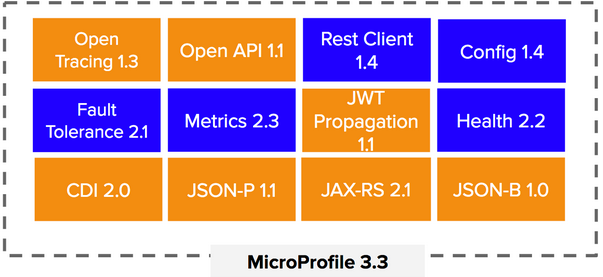

## Apresentação Quarkus

---

Criando Microserviço com Quarkus

- Introdução ao Microprofile

  

- Dependencias

  - quarkus-rest-client-jackson
  - quarkus-mongodb-panache
  - quarkus-rest-client
  - quarkus-smallrye-fault-tolerance
  - quarkus-smallrye-health

- Faze demonstração

  - Criar endpoint básico `OrderResource` retorna um json qualquer
    
    - Redeploy​ ​ :heavy_check_mark:
    
  - Criar Entidade
    
    - extend PanacheEntity ​ :heavy_check_mark:
    
  - Criar End-point
      - POST
        
        - Criar validação antes de salvar :heavy_check_mark:
        - Criar exception handler informando que produto já está cadastrado :heavy_check_mark:
      - GET
        - Filtro :heavy_check_mark:
        
        - Criando Profiles :heavy_check_mark:
        
          `./mvnw -Dquarkus.profile=prod quarkus:dev`
        
        - paginação​ :heavy_check_mark:
        
        - Projections :heavy_check_mark:
      
  - Subir servico de estoque 

  - Fazer requisicao

  - fault-tolerance

    - Annotation `@Fallback` :heavy_check_mark:
    - Annotation `@Retry` :heavy_check_mark:
    - Annotation `@Timeout` :heavy_check_mark:
    - Annotation `@CircuitBreak` :heavy_check_mark:

  - Health check :heavy_check_mark:

